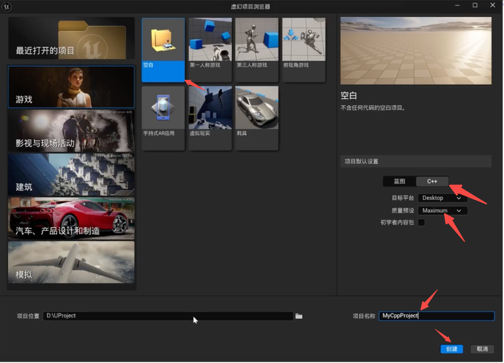
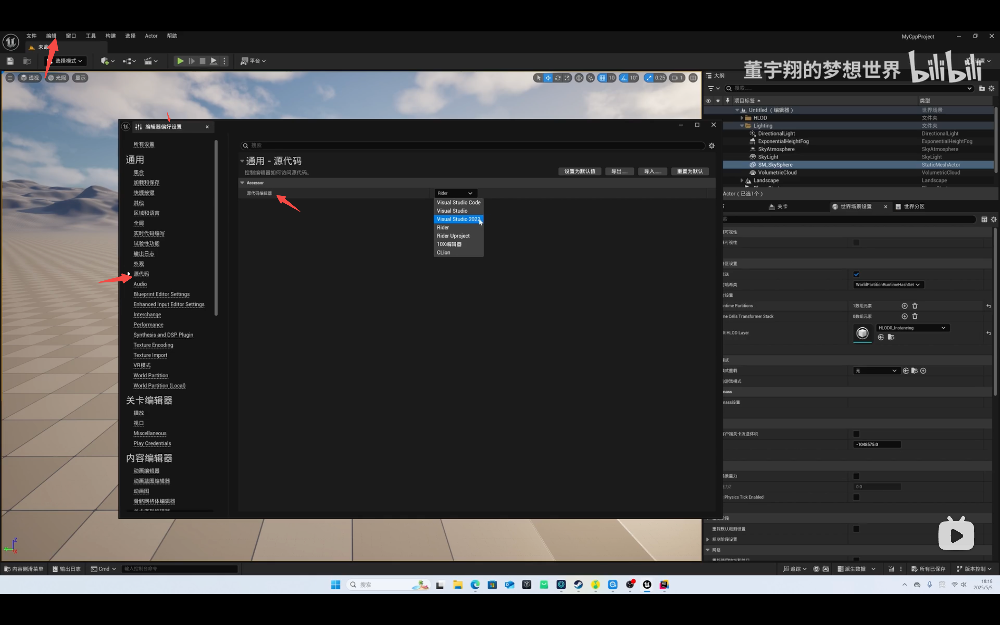
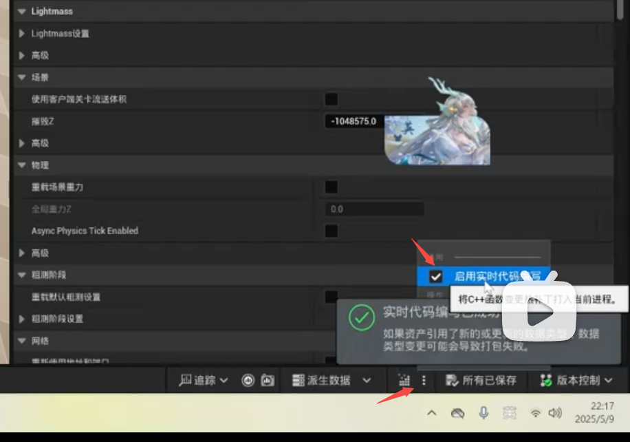
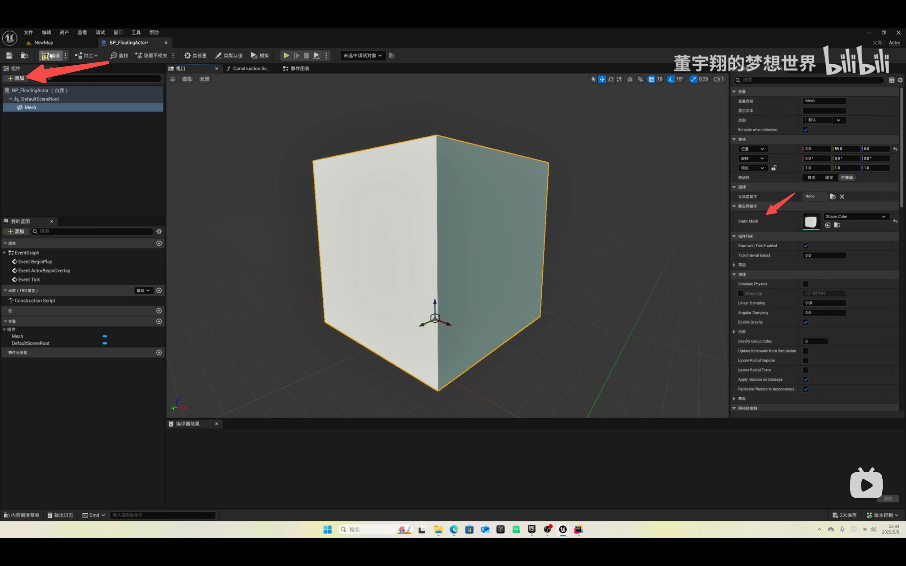
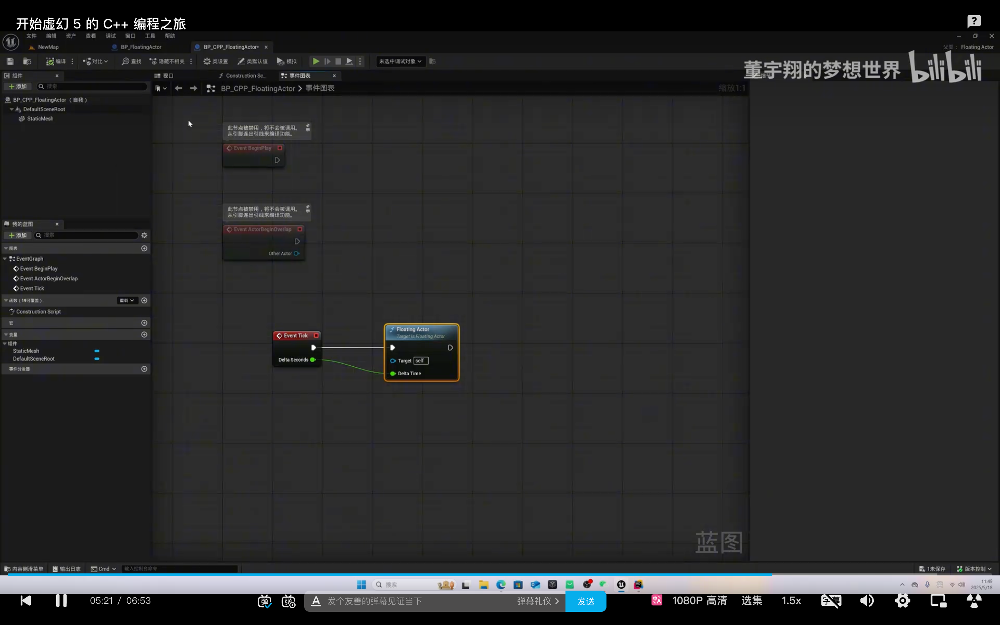

- 相关链接:
    [UE5 C++ 编程文档](https://dev.epicgames.com/documentation/zh-cn/unreal-engine/programming-with-cplusplus-in-unreal-engine)
    [教程：开始虚幻 5 的 C++ 编程之旅](https://www.bilibili.com/video/BV1t3V6z5EzY)
- 开发工具配置：

1. 安装 epic -> 安装虚幻引擎
2. 安装 vs2022(.net 桌面开发，c++游戏开发...)
3. rider(c++编辑器)

### UE5 C++ 项目创建



修改代码编辑器：

编辑 —> 编辑器偏好设置 -> 源代码 -> 源代码编辑器



C++ 项目目录：

- Engine
- Games(Config:配置 Source:源代码)
- Programs

### 项目代码版本管理

- git:管理源代码
- git lfs:游戏资源管理（大文件） git lfs install
- 设置配置：

```shell
git config --global user.name "xxxxx"
git config --global user.emial "xxxxx"
# 查看配置信息
git config -l
```

- [版本管理配置](https://gitcode.com/gh_mirrors/ue/ue5-gitignore)

### 创建第一个 C++类

- 准备工作

1. 保存地图（content->Maps）
2. 版本控制(页面右下角)
3. 打开 rider(工具-> 打开 rider)

- [新建 c++类](https://dev.epicgames.com/documentation/zh-cn/unreal-engine/unreal-engine-cpp-quick-start?application_version=5.6)

1. 工具->添加 c++类
2. 选择 actor
3. 命名(FloatingActor)后创建类

- 实时编译代码开关（live code）
  

UE 宏： UCLASS()、GENERATED_BODY()， UPROPETRY()

```cpp
    // FloatingActor.h
    // 声明变量
    UPROPERTY(VisibleAnywhere)
    UStaticMeshComponent* VisualMesh;
```

```cpp
    // FloatingActor.cpp
    // 创建mesh组件
    VisualMesh = CreateDefaultSubobject<UStaticMeshComponent>(TEXT("Mesh"));
    VisualMesh->SetupAttachment(RootComponent);
    // 查找指定的shape资源
    static  ConstructorHelpers::FObjectFinder<UStaticMesh> CubeVisualAsset(TEXT("/Game/StarterContent/Shapes/Shape_Cube.Shape_Cube"));

    if (CubeVisualAsset.Succeeded()){
        // 将shape资源设置给mesh组件
        VisualMesh->SetStaticMesh(CubeVisualAsset.Object);
        // 设置mesh组件的位置
        VisualMesh->SetRelativeLocation(FVector(0.0f, 0.0f, 0.0f));
    }
```

### C++和蓝图类实现功能比较

1. 使用蓝图实现上方代码逻辑：
    - 创建蓝图文件夹（内容/Buleprint）
    - 右键创建蓝图类，父类选择Actor，命名BP_FloatingActor
    - 添加一个staticMesh组件，重命名Mesh
    - Static Mesh设置为Shape_Cube



2. 添加逻辑
- 在onTick(float DeltaTime)下编写代码
```cpp
    FVector NewLocation = GetActorLocation();
    FRotator NewRotation = GetActorRotation();
    float RunningTime = GetGameTimeSinceCreation();
    float DeltaHeight = (FMath::Sin(RunningTime + DeltaTime) - FMath::Sin(RunningTime));
    NewLocation.Z += DeltaHeight * 20.0f;       //Scale our height by a factor of 20
    float DeltaRotation = DeltaTime * 20.0f;	//Rotate by 20 degrees per second
    NewRotation.Yaw += DeltaRotation;
    SetActorLocationAndRotation(NewLocation, NewRotation);
```
- 在蓝图中实现(11:00-15:30),过程过于复杂，可跟着视频复现

- 视图逻辑在蓝图中实现，编写逻辑使用c++代码实现

### C++类和蓝图类结合使用

- 删除FloatingActor中视图绑定的代码
- 创建函数

```cpp
// FloatingActor.h
UFUNCTION(BuleprintCallable)
virtual void FloatingActor(float DeltaTime);
```

```cpp
// FloatingActor.cpp
void FloatingActor:FloatingActor(float DeltaTime){
    FVector NewLocation = GetActorLocation();
    FRotator NewRotation = GetActorRotation();
    float RunningTime = GetGameTimeSinceCreation();
    float DeltaHeight = (FMath::Sin(RunningTime + DeltaTime) - FMath::Sin(RunningTime));
    NewLocation.Z += DeltaHeight * 20.0f;       //Scale our height by a factor of 20
    float DeltaRotation = DeltaTime * 20.0f;	//Rotate by 20 degrees per second
    NewRotation.Yaw += DeltaRotation;
    SetActorLocationAndRotation(NewLocation, NewRotation);
}
```

- 创建蓝图
1. 创建蓝图是选择父类为FloatingActor
    - 添加一个staticMesh组件，重命名Mesh
    - Static Mesh设置为Shape_Cube
    - 在事件图表中的Event Tick中调用FloatingActor方法

