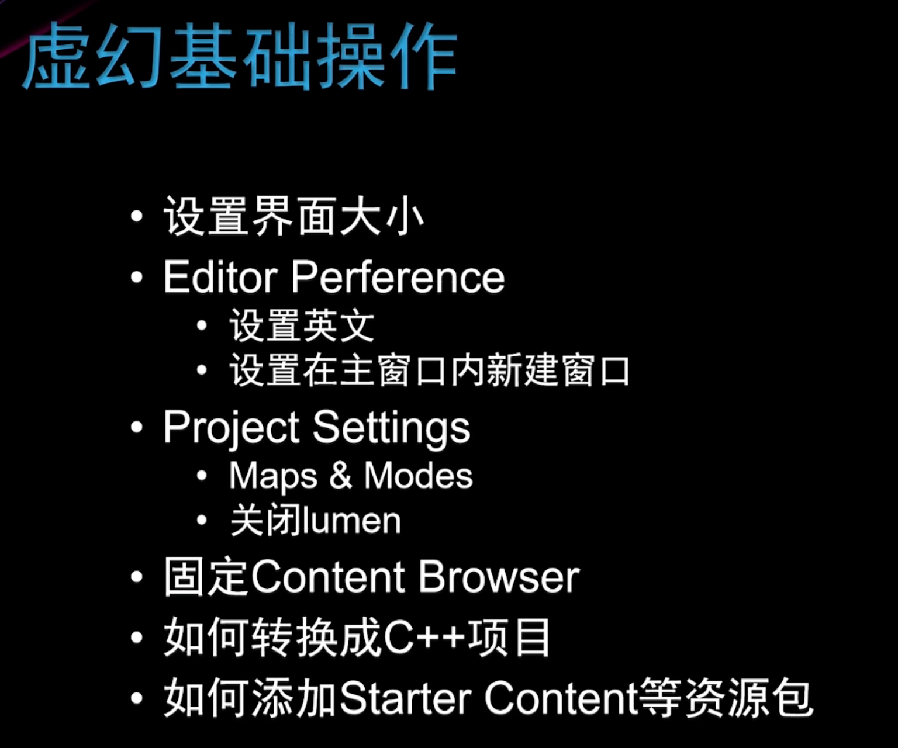

- [课程地址](https://www.bilibili.com/video/BV1bQ4y1L7gJ)

### 虚幻引擎基础操作

- 编辑器设置
    - Edit -> Editor Preferences
    - 设置编辑器语言：Region & Language -> Editor Language:English
    - 设置从主窗口打开文件浏览： All Setting -> User Interface -> Asset Editor Open Location:MainWindow
    - Edit -> Project Settings:
    - Default Maps: Editor Startup Map(编辑器开始地图)/Game Default Map(游戏开始地图)
    - 关闭lumen:Project Settings -> Engine-Rendering  -> Global liumination/Reflection

- 编辑器操作
    - ctrl + 空格：内容浏览器（Content Browser）
    - 转C++:编辑菜单中添加新的C++类
    - 添加资源包： ContentBrowser左上角的add按钮

- 工具栏
    - 运行后: shift + F1: 取消游戏焦点
    - Place Actors: .../光源/...
- 主视图
    - 显示菜单(帧率...)
    - 视图
    - 光照
    - 显示过滤器
    - <----------------->
    - 选择/移动(W)/旋转(E)/缩放(R)
    - 坐标系模式
    - 贴附模式
    - 移动/旋转/缩放-粒度选择
    - 镜头移动速度
    - 四格视图

    - 移动视角：鼠标中键 + a\s\w\d\q\e
    - 聚焦物体：F、大纲中双击
    - ctrl + B：定位内容中的位置
    - ctrl + E：直接打开选中元素的蓝图
    - End：贴附到底部
    - ctrl + D:复制（ctrl + C、V）、（alt + 轴向移动）

- 大纲
- World Settings
- Details:物体信息
 - 直接修改实例的参数

### 虚幻商城与Quixel Bridge
- 虚幻商城： 
    - create project(Unreal Learning Kit)
        - Marketplace
        - create project后，可以选择自己所需的content migrate自己的项目中
        - File -> Save current Level

    - add project(Adventure Character\Stylized Character Kit:Casual 01)

- Quixel Bridge：工具栏中添加按钮中的下拉菜单中(好像已经弃用了)