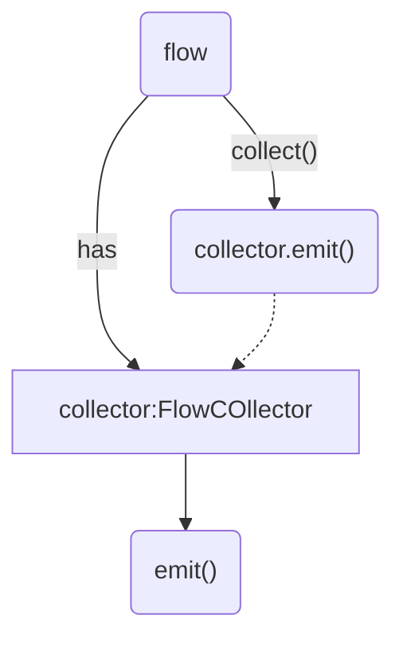

# Flow
```java
public interface FLow<out T>{
    public suspend fun collect(collector:FlowCollector<T>)
}

public interface FlowCollector<in T>{
    public suspend emit(value)
}
```



当flow调用collect()时就是调用collector.emit(),所以flow时冷流数据，只用消费者消耗数据时，生产者才生产数据

AbstractFlow:使用了try-catch处理异常情况

```java
public abstract class AbstractFlow<T> : Flow<T>, CancellableFlow<T> {

    public final override suspend fun collect(collector: FlowCollector<T>) {
        //SafeCollector同样使用了try-catch处理emit()可能发生的异常
        val safeCollector = SafeCollector(collector, coroutineContext)
        try {
            collectSafely(safeCollector)
        } finally {
            safeCollector.releaseIntercepted()
        }
    }

    public abstract suspend fun collectSafely(collector: FlowCollector<T>)
}
```

SafeFlow：AbstractFlow的简单实现，调用的collectSafely()相当于Flow.collct()，其中collector.block()相当于调用了FlowCollector.emit(),这里调用了block()是flow函数的形参

```java
private class SafeFlow<T>(private val block: suspend FlowCollector<T>.() -> Unit) : AbstractFlow<T>() {
    override suspend fun collectSafely(collector: FlowCollector<T>) {
        collector.block()//相当于emit（）
    }
}
```

函数：simpleChannelFlow

```java
internal fun <T> simpleChannelFlow(block: suspend SimpleProducerScope<T>.() -> Unit): Flow<T>{
    return flow{
        //simpleChannelFlow的函数体
    }
}

//相当于===>

internal fun <T> simpleChannelFlow(block: suspend SimpleProducerScope<T>.() -> Unit) 
= SafeFlow("simpleChannelFlow的函数体")

//SafeFlow上面讲过是AbstractFlow的简单实现，使用try-catch处理异常，保存程序安全，所以“simpleChannelFlow的函数体”相当于FlowCollector的emit(）(生产者)
```

- simpleChannelFlow的函数体

```java
    coroutineScope {
        val channel = Channel<T>(capacity = Channel.RENDEZVOUS)
        val producer = launch {
            try {
                // run producer in a separate inner scope to ensure we wait for its children
                // to finish, in case it does more launches inside.
                coroutineScope {
                    val producerScopeImpl = SimpleProducerScopeImpl(
                        scope = this,
                        channel = channel,
                    )
                    producerScopeImpl.block()
                }
                channel.close()
            } catch (t: Throwable) {
                channel.close(t)
            }
        }
        //**FlowCollector的特征**
        for (item in channel) {
            emit(item)
        }
        // in case channel closed before producer completes, cancel the producer.
        producer.cancel()
    }

```