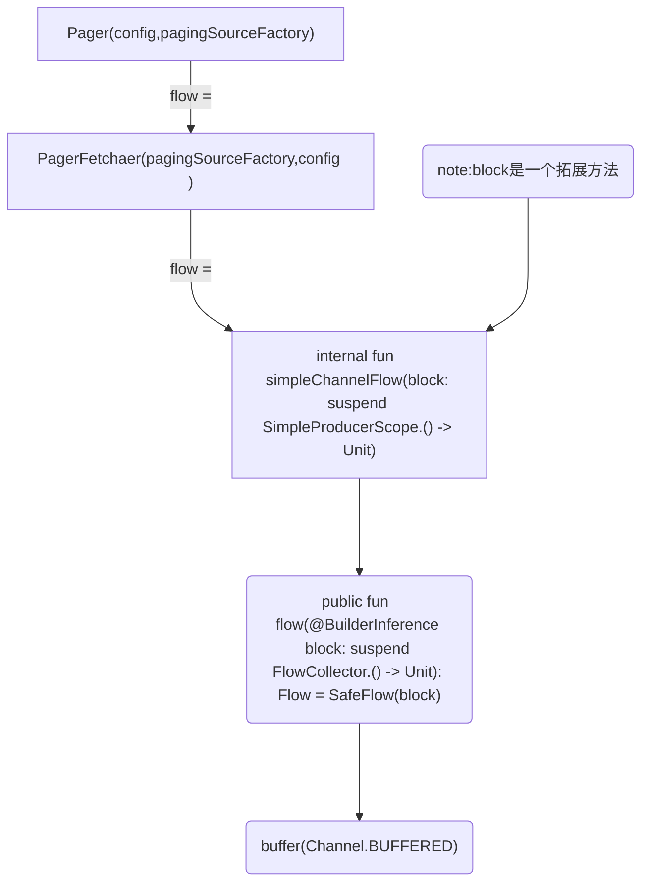

# PagingDateAdapter绑定数据时如何获取数据的

1. PagingDateAdapter
```java
 PagingDateAdapter.getItem(@IntRange(from = 0) position: Int) = differ.getItem(position)
 //differ:AsyncPagingDataDiffer(Async:异步)
```

2. AsyncPagingDataDiffer
```java
    AsyncPagingDataDiffer.getItem(@IntRange(from = 0) index: Int): T?{ 
        try {
            inGetItem = true
            return differBase[index]
            //differBase:PagingDataDiffer<T> 运算符重载了get方法
        } finally {
            inGetItem = false
        }
    }
```
3. PagingDataDiffer<T>重载get()方法
```java
    lastAccessedIndexUnfulfilled = true
    lastAccessedIndex = index
    //检查当前获取数据在加载到本地数据集中的位置是否可以触发加载线上数据
    //receiver来自于PageData,是否是在PageData的创建中创建的该对象
    //todo:receiver的具体实现？question3
    receiver?.accessHint(presenter.accessHintForPresenterIndex(index))
    /**
    *  fun accessHint(viewportHint: ViewportHint)
    *
    *   ViewportHint: 加载访问信息团，包含了presenter的信息
    *       Initial:
    *           [ViewportHint] reporting presenter state after receiving initial page.
    *           ViewportHint报告presenter的状态之后接收初始页面(数据)
    *           take precedence over 优先于
    *           An [Initial] hint should never take precedence over an [Access] hint and is only used to inform
    *           一个[Initial]提示永远不应该优先于一个[Access]提示并且只用于通知
    *           [PageFetcher] how many items from the initial page load were presented by [PagingDataDiffer]
    *           [PagingDataDiffer]显示了初始页面加载中的多少项
    *       Access:
    *           [ViewportHint] representing an item access that should be used to trigger loads to fulfil prefetch distance.
    *           代表了一个item访问要达到触发加载的距离
    *           
    **/
    //presenter: PagePresenter<T>
    return presenter.get(index)
```
4. PagePresenter.get(index: Int): T?()
```java
//检查index的合法性
 fun get(index: Int): T? {
    checkIndex(index)
    //placeholdersBefore 占位符之前的index
    val localIndex = index - placeholdersBefore
    //storageCount 存储数据的count
    if (localIndex < 0 || localIndex >= storageCount) {
        return null
    }
    return getFromStorage(localIndex)
 }
```
5. PagePresenter.getFromStorage(index: Int): T?()

```java
override fun getFromStorage(localIndex: Int): T {
    var pageIndex = 0
    var indexInPage = localIndex

    // Since we don't know if page sizes are regular, we walk to correct page.
    // 因为我们不知到每个page的pageSize是否一样，所以需要从第0页开始遍历，直到当前的最后一个元素的index大于localIndex，便找到了该元素的页数，
    // 而减去前面每页的PageSize后得到的就是该元素在本页数据的位置
    val localPageCount = pages.size
    while (pageIndex < localPageCount) {
        val pageSize = pages[pageIndex].data.size
        if (pageSize > indexInPage) {
            // stop, found the page
            break
        }
        indexInPage -= pageSize
        pageIndex++
    }
    //通过pageIndex获取正确page,再通过indexInPage获取元素
    return pages[pageIndex].data[indexInPage]
    /**
     * pages的结构：MutableList<TransformablePage<T>>
     * 因此page.data就是：TransformablePage<T>
     * TransformablePage<T : Any>{
     *      val data: List<T>
     *   }
     * data中保存了本页的数据
     **/
}
```

- 总结：PagingDataAdpater中根据Item的Position通过AsyncPagingDataDiffer.getItem()获取数据，
       AsyncPagingDataDiffer通过PagingDataDiffer的重载运算符get()获取数据，
       PagingDataDiffer通过PagePresenter.get()获取数据
       PagePresenter通过get()检查index的合法性然后再调用自己的getFromStorage()从pages列表中获取当前page:TransformablePage<T>
       TransformablePage<T>中使用List<T>存储本页数据，即目标数据从这里返回
       因此在Paging中请求来的数据最终保存在了PagePresenter中的pages中 ———— 以每页数据为一个List，保存在pages:MutableList中

# PagingDateAdapter.submitData()如何保存到PagePresenter的pages中的
1. 通过submitData提交数据
    1. PagingDataAdapter.submitData(PageData<T>())
    2. differ:AsyncPagingDataDiffer.submitData(PageData<T>())
        1. submitDataId:AtomicInteger.incrementAndGet()//计数增量
        2. differBase:PagingDataDiffer.collectFrom(PageData<T>())//从PageData中收集数据

# collectFrom(PageData<T>())细读

1. SingleRunner（单协程执行器？）

```java
/**             保证       单次执行                    传递给
 * Class which guarantees single execution of blocks passed to [runInIsolation] by cancelling the previous call. 
 * 该类通过取消前一次的调用来保证传递给[runInIsolation]方法的代码块单次执行
 * [runInIsolation] is backed by a [Mutex], which is fair, so concurrent callers of [runInIsolation] will trigger in order, 
 * [runInIsolation]由一个[互斥锁]支持，这是合理的，因此[runInIsolation]的并发调用者将按顺序触发，
 * with the last call winning (by cancelling previous calls)
 * 最后一个调用获胜(通过取消之前的调用)
 *
 * isolation 隔离
 */
suspend fun runInIsolation(
        priority: Int = DEFAULT_PRIORITY,
        block: suspend () -> Unit
    ) {
        try {
            coroutineScope {
                //coroutineContext[Job] "[]"是一个操作符重载operator (CoroutineContext)
                //实际调用方法 ===> public operator fun <E : Element> get(key: Key<E>): E?
                // Key(interface) ===>    public interface Key<E : Element>
                // public interface Element : CoroutineContext 
                // Element重写了get()方法
                /**
                *  //
                * public override operator fun <E : Element> get(key: Key<E>): E? =
                *       @Suppress("UNCHECKED_CAST")
                *       if (this.key == key) this as E else null
                **/
                //检查myJob是否为空
                val myJob = checkNotNull(coroutineContext[Job]) {
                    "Internal error. coroutineScope should've created a job."
                }
                //替换当前job,前提是job的优先级低于前一个job，前一个job被cannel或者join
                val run = holder.tryEnqueue(
                    priority = priority,
                    job = myJob
                )
                if (run) {//执行新的job
                    try {
                        block()
                    } finally {
                        //holder 重置
                        holder.onFinish(myJob)
                    }
                }
            }
        } catch (cancelIsolatedRunner: CancelIsolatedRunnerException) {
            // if i was cancelled by another caller to this SingleRunner, silently cancel me
            if (cancelIsolatedRunner.runner !== this@SingleRunner) {
                throw cancelIsolatedRunner
            }
        }
    }
```

- SingleRunner 的作用就是只执行最新提交的任务，将就任务cannel或者join()//挂起直到被执行结束，question1:有job执行不全吗？

collectFromRunner.runInIsolation {
    //blocking
}


- 因此上面的blocking就是一个job, blocking代码如下：

```java
    receiver = pagingData.receiver
    // TODO: Validate only empty pages between separator pages and its dependent pages.
    // flow:Flow<PageEvent<T>>  PageEvent:sealed(Drop,Insert,LoadStateUpate)
    pagingData.flow.collect { event -> //FlowCollector<PageEvent<T>> ==> func: emit<PageEvent<T>>
        withContext(mainDispatcher) {//开启协程运行在主线程；执行blocking
            //blocking
        }
    }
```

```java
    Flow.collect { event -> 
        //blocking
    }
    /** 对上面的代码的理解 **/
    // 非lambda写法
    Flow.collect(object:Flow<PageEvent<T>>{
      override suppend fun emit(value:PageEvent<T>){
        //blocking
      }  
    })
    //因此lambda的写法中event就是emit()传递过来的参数：PageEvent<T>
```

- 开启协程运行在主线程：执行blocking，其blocking代码如下

```java
    if (event is Insert && event.loadType == REFRESH) {//本次事件是更新和插入事件，执行insertofRefreshBlocking
        //insertofRefreshBlocking             
    } else {
        if (postEvents()) {//默认不执行
            //Yields the thread (or thread pool) of the current coroutine dispatcher to other coroutines on the same dispatcher to run if possible
            //如果可能，将当前协程分配器的线程(或线程池)交付给同一分配器上的其他协程以运行
            yield()
        }
        /**
        *   Presents post-transform paging data as a list, with list update notifications when PageEvents are dispatched.
        *   当PageEvents被分发时Present以列表的方式提交PagingData的变化和列表的更新通知
        **/
        // processPageEventCallback : ProcessPageEventCallback：监听数据更新和状态变化
        // Send event to presenter to be shown to the UI.
        // 根据event来通知UI数据更新和状态变化
        presenter.processEvent(event, processPageEventCallback)

        // Reset lastAccessedIndexUnfulfilled if a page is dropped, to avoid
        // infinite loops when maxSize is insufficiently large.
        if (event is Drop) {//删除事件
            lastAccessedIndexUnfulfilled = false
        }

        // If index points to a placeholder after transformations, resend it unless
        // there are no more items to load.
        if (event is Insert) {//本次事件为插入事件但不是更新，因此是追加数据，执行insertofAppendBlocking
            //insertofAppendBlocking
        }
    }
    // Notify page updates after presenter processes them.
    // 处理之后的通知
    // Note: This is not redundant with LoadStates because it does not de-dupe
    // in cases where LoadState does not change, which would happen on cached
    // PagingData collections.
    if (event is Insert || event is Drop) {
        onPagesUpdatedListeners.forEach { it() }
    }
```
- 上面代码主要对event的事件类型进行处理：
    1. 数据刷新的插入事件执行：insertofRefreshBlocking
    2. 非刷新事件下
        2.1. 根据event来通知UI数据更新和状态变化
        2.2. 如果是删除事件，lastAccessedIndexUnfulfilled为false//question2:lastAccessedIndexUnfulfilled的作用？
        2.2. 如果是插入事件即为追加数据，执行：insertofAppendBlocking
    3. 事件处理后的通知


- 当事件是数据刷新的插入事件时，执行insertofRefreshBlocking，其代码如下：

```java
lastAccessedIndexUnfulfilled = false

val newPresenter = PagePresenter(event)
var onListPresentableCalled = false
val transformedLastAccessedIndex = presentNewList(
    previousList = presenter,
    newList = newPresenter,
    lastAccessedIndex = lastAccessedIndex,
    onListPresentable = {
        presenter = newPresenter
        onListPresentableCalled = true
    }
)
check(onListPresentableCalled) {
    "Missing call to onListPresentable after new list was presented. If " +
        "you are seeing this exception, it is generally an indication of " +
        "an issue with Paging. Please file a bug so we can fix it at: " +
        "https://issuetracker.google.com/issues/new?component=413106"
}

// Dispatch LoadState updates as soon as we are done diffing, but after
// setting presenter.
dispatchLoadStates(event.sourceLoadStates, event.mediatorLoadStates)

if (transformedLastAccessedIndex == null) {
    // Send an initialize hint in case the new list is empty, which would
    // prevent a ViewportHint.Access from ever getting sent since there are
    // no items to bind from initial load.
    receiver?.accessHint(newPresenter.initializeHint())
} else {
    // Transform the last loadAround index from the old list to the new list
    // by passing it through the DiffResult, and pass it forward as a
    // ViewportHint within the new list to the next generation of Pager.
    // This ensures prefetch distance for the last ViewportHint from the old
    // list is respected in the new list, even if invalidation interrupts
    // the prepend / append load that would have fulfilled it in the old
    // list.
    lastAccessedIndex = transformedLastAccessedIndex
    receiver?.accessHint(
        newPresenter.accessHintForPresenterIndex(
            transformedLastAccessedIndex
        )
    )
}
```

```java

//differCallback：DifferCallback => updateCallback:ListUpdateCallback => AdapterListUpdateCallback => RecyclerView.Adapter
override suspend fun presentNewList(
            previousList: NullPaddedList<T>,
            newList: NullPaddedList<T>,
            lastAccessedIndex: Int,
            onListPresentable: () -> Unit,
        ) = when {
            // fast path for no items -> some items
            //旧数据为空是直接插入新数据
            previousList.size == 0 -> {
                onListPresentable()
                differCallback.onInserted(0, newList.size)
                null
            }
            // fast path for some items -> no items
            //新数据为空是删除旧数据
            newList.size == 0 -> {
                onListPresentable()
                differCallback.onRemoved(0, previousList.size)
                null
            }
            else -> {
                val diffResult = withContext(workerDispatcher) {
                    previousList.computeDiff(newList, diffCallback)
                }
                onListPresentable()
                previousList.dispatchDiff(updateCallback, newList, diffResult)
                previousList.transformAnchorIndex(
                    diffResult = diffResult,
                    newList = newList,
                    oldPosition = lastAccessedIndex
                )
            }
        }
```




#### simpleChannelFlow()

