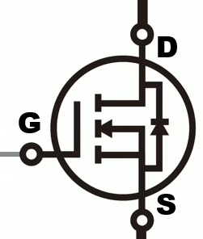
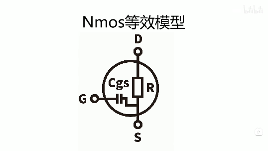
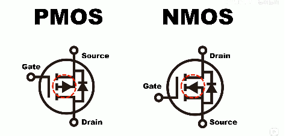

### nmos的介绍

1. 介绍
    * 引脚名称： Gate(G)、Drain(D)、Source(S)
    * 使用场景：当G为高电平时，DS导通，反正断路

2. 选型
    - 封装(根据实际使用场景选择)
    - 等效模型：
    
     

    - Vgsth：使ds通路时所需的最小电压，应小于系统内的电源电压
    - Rdson：通路时，ds之间中的电阻值，影响功耗
    - Cgs:Rdson与 Cgs成反比，影响mos打开速度，过大会使pwm失真

### nmos与pmos的区别

